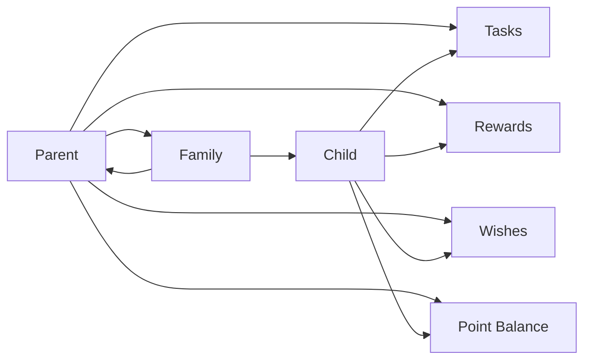
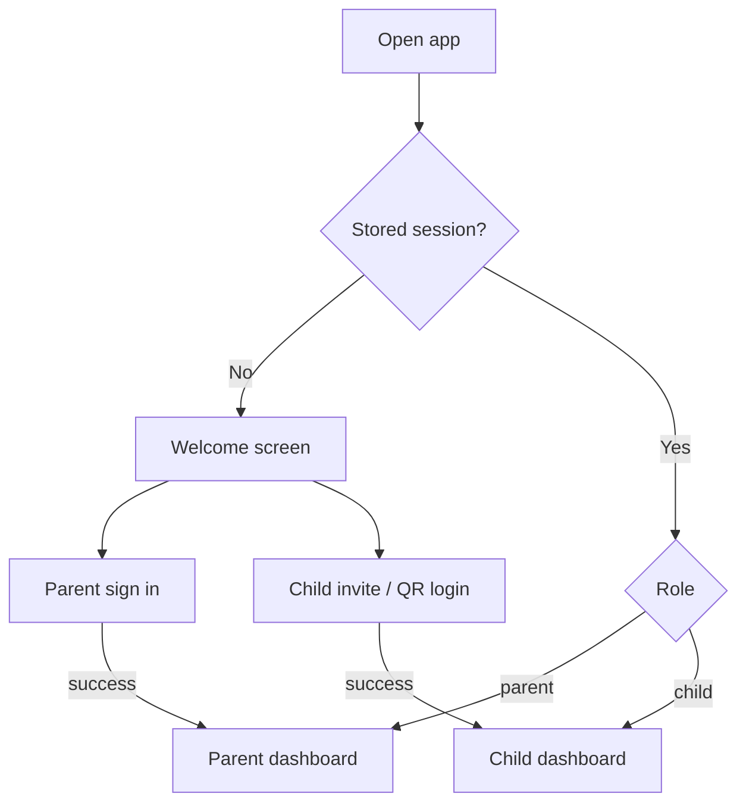
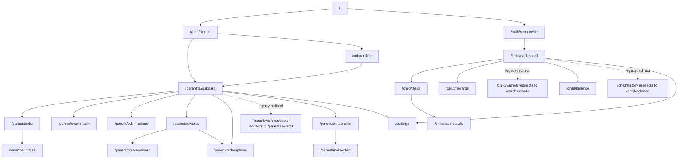
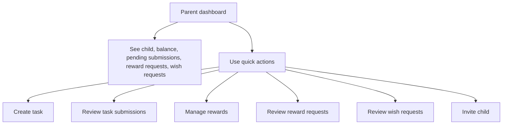
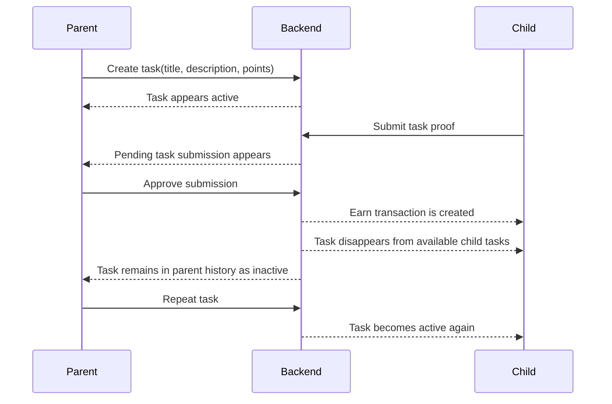
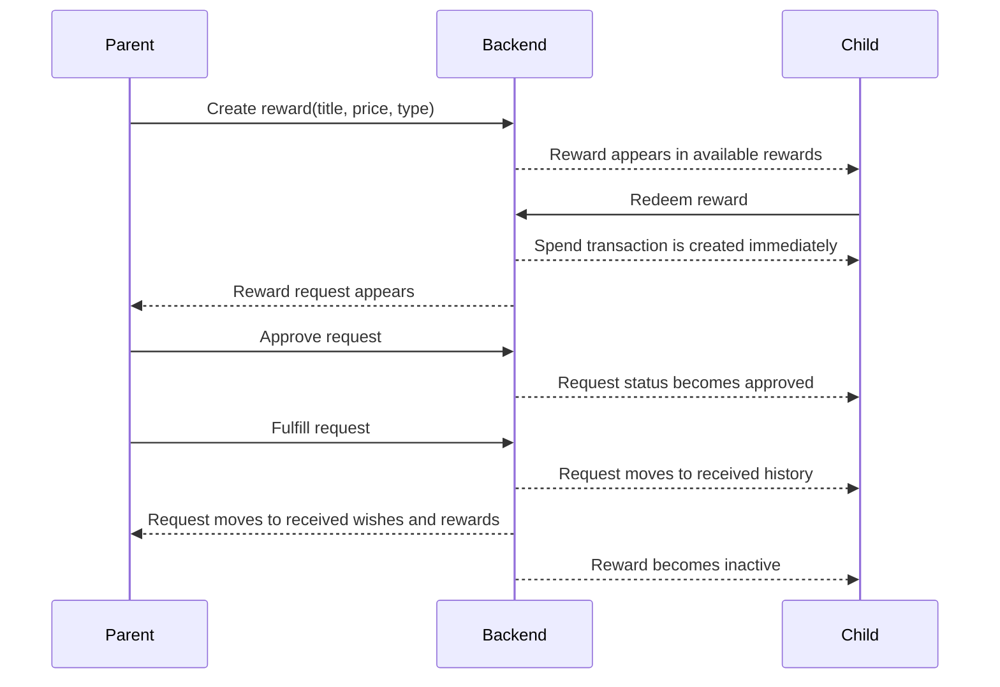
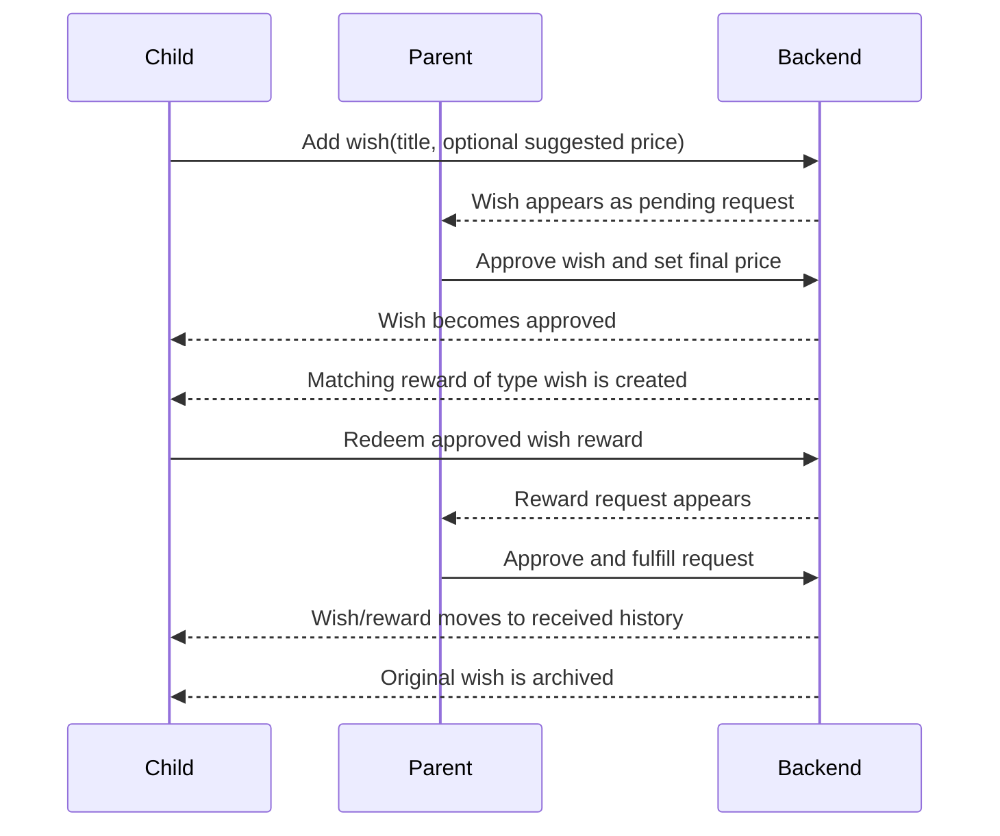
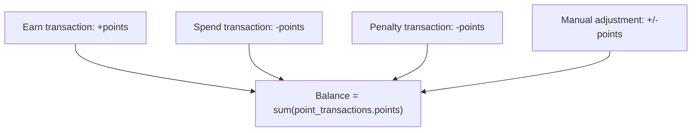
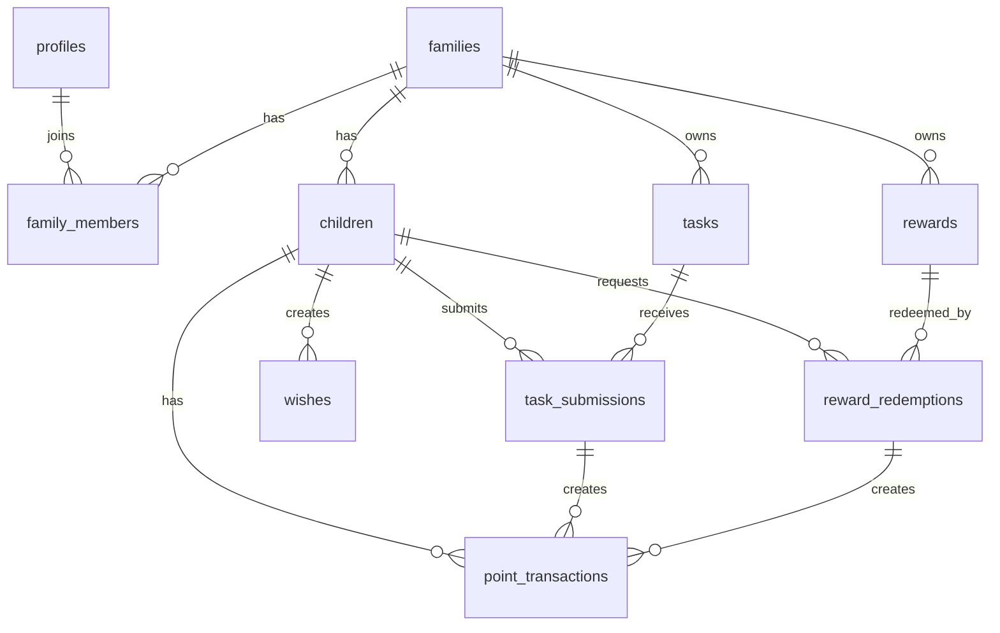

# easyQuest App Flow Plan

This document describes the current MVP product logic for easyQuest: roles, navigation,
backend state, and what should happen after each important user action.

## Product Idea

easyQuest is a family task and reward app.

- Parent creates children, tasks, rewards, and approves child actions.
- Child completes tasks, earns points after parent approval, and spends points on rewards or approved wishes.
- Wishlist is a child-led request flow: child asks for something, parent approves and sets the price, then it becomes a redeemable reward.

## Core Roles

## App Entry And Auth

Auth rules:

- If a parent is signed in, guest screens should redirect to `parent/dashboard`.
- If a child is signed in, guest screens should redirect to `child/dashboard`.
- Parent routes are blocked for child sessions.
- Child routes are blocked for parent sessions.
- Dashboard back button is replaced with logout because the welcome screen is not useful after auth.
- Child invite login is stored locally, so the child should not need a new invite link on every app start.

## Navigation Map

Navigation notes:

- Main parent and child screens keep persistent bottom navigation.
- Focused form/detail flows such as create, edit, invite, and task detail screens do not show bottom navigation.
- Bottom menus should link to the combined pages, not to legacy redirect routes.
- Child rewards and wishes live in `/child/rewards`.
- Child balance and task history live in `/child/balance`.
- Parent reward catalog and wish requests live in `/parent/rewards`.

## Parent Main Flow

Dashboard should answer:

- Who is the active child?
- What is the child balance?
- How many task submissions need review?
- How many reward requests need review?
- How many wish requests need review?
- What is the fastest next action for the parent?

## Task Flow

Task rules:

- Created task starts as `active`.
- Child sees only active tasks without an open pending submission.
- When child taps `I did it`, submission status becomes `pending`.
- Parent can approve or reject.
- Approve creates an `earn` point transaction.
- Approved task becomes inactive for the child but remains visible to parent in history.
- Parent can repeat the task by activating it again.

## Reward Flow

Reward rules:

- Child can redeem only if balance is enough.
- Spend transaction is created when child requests the reward.
- If parent rejects, points are refunded with a `manual_adjustment` transaction.
- Parent approval means "allowed".
- Parent fulfillment means "actually delivered".
- Fulfilled rewards move to `Received wishes and rewards`.
- Fulfilled rewards become inactive, but parent can repeat them.

## Wish Flow

Wish rules:

- Child may create a wish without a final price.
- Parent sets the final point price.
- Approved wish creates a reward with type `wish`.
- After child redeems the wish reward, the wish should no longer sit in active wishlist screens.
- After parent fulfills it, the item belongs only in `Received wishes and rewards`.
- Fulfilled wish rewards should not remain as approved wishes.

## Balance Logic

Transaction types:

- `earn`: parent approved a completed task.
- `spend`: child requested a reward or approved wish reward.
- `penalty`: future parent penalty flow.
- `manual_adjustment`: refunds or future manual balance correction.

## Backend State Model

Important tables:

- `profiles`: parent or child profile.
- `families`: family group.
- `family_members`: parent membership in family.
- `children`: child records connected to family and child invite profile.
- `tasks`: parent-created task templates.
- `task_submissions`: child completion requests.
- `rewards`: parent-created rewards and wish-generated rewards.
- `reward_redemptions`: child reward requests.
- `wishes`: child wishlist requests.
- `point_transactions`: balance ledger.

## Screen Responsibilities

| Screen | Responsibility |
| --- | --- |
| `index` | Guest entry point: parent sign-in and child invite. |
| `auth/sign-in` | Parent email/password auth and parent account creation. |
| `auth/scan-invite` | Child invite code or QR login. |
| `onboarding` | Authenticated parent setup: create family and first child. |
| `parent/dashboard` | Parent overview and quick actions. |
| `parent/tasks` | Parent task list, active/inactive state, edit entry. |
| `parent/create-task` | Create backend task. |
| `parent/submissions` | Review task submissions and task history. |
| `parent/rewards` | Combined reward catalog and child wish requests. |
| `parent/create-reward` | Create backend reward. |
| `parent/redemptions` | Review reward requests and received/rejected history. |
| `parent/wish-requests` | Legacy redirect to `parent/rewards`. |
| `child/dashboard` | Child balance, nearest visible wish, available tasks, quick actions. |
| `child/tasks` | Available child tasks. |
| `child/task-details` | Submit task proof. |
| `child/rewards` | Available rewards, pending requests, received rewards/wishes, wow effect on redeem. |
| `child/wishes` | Legacy redirect to `child/rewards`. |
| `child/balance` | Combined point transaction history and task history. |
| `child/history` | Legacy redirect to `child/balance`. |

## Current Product Invariants

- Never show auth screens to an already signed-in user.
- Never show parent screens to child sessions.
- Never show child screens to parent sessions.
- Do not show completed wish rewards in active wishlist.
- Do not show fulfilled rewards in available rewards.
- Do not double-spend points for the same reward redemption.
- Rejecting a reward redemption should refund points once.
- A fulfilled reward or wish reward belongs to received history.

## Suggested Next Stages

1. Add reliable database links between `wishes` and generated `rewards`.
   Current matching is title/price based. A future migration should add `source_wish_id` to `rewards`.

2. Add explicit backend RPCs for parent reward and task actions.
   This will keep RLS simple and centralize business rules.

3. Add loading/error surfaces to every async parent and child action.
   Some older actions still use fire-and-forget UI.

4. Add simple automated tests for domain rules.
   Start with task approval, reward spend/refund, wish approval, and fulfilled wish archiving.

5. Add a true multi-child selector.
   Parent already supports multiple children, but many screens still assume the first or active child.
