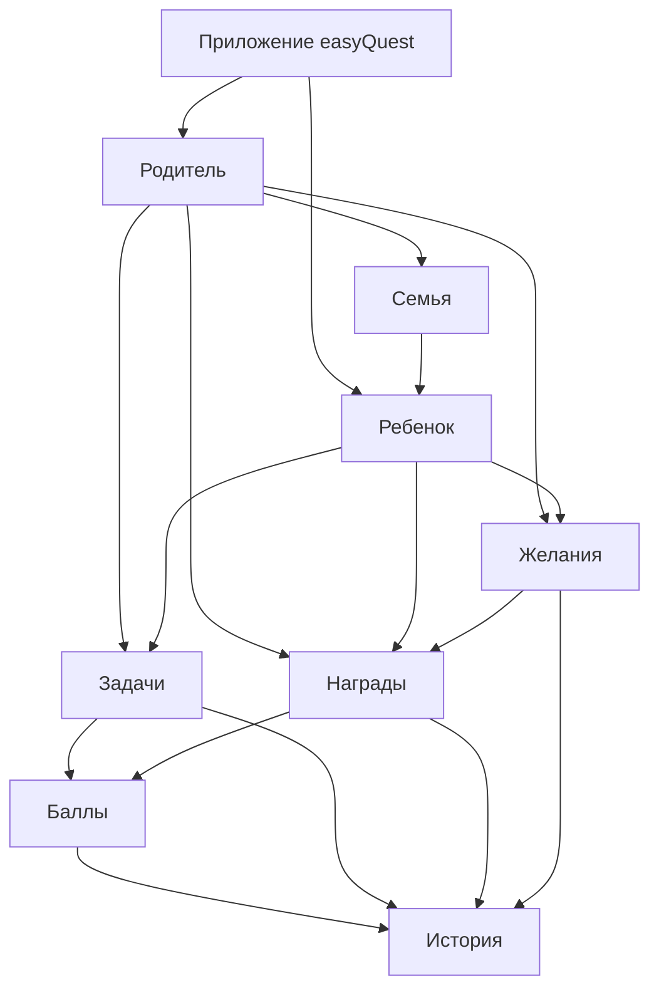
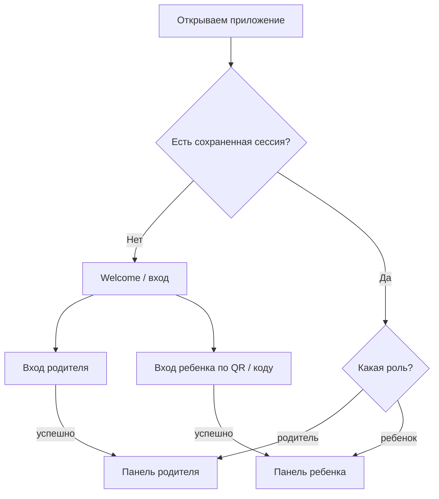
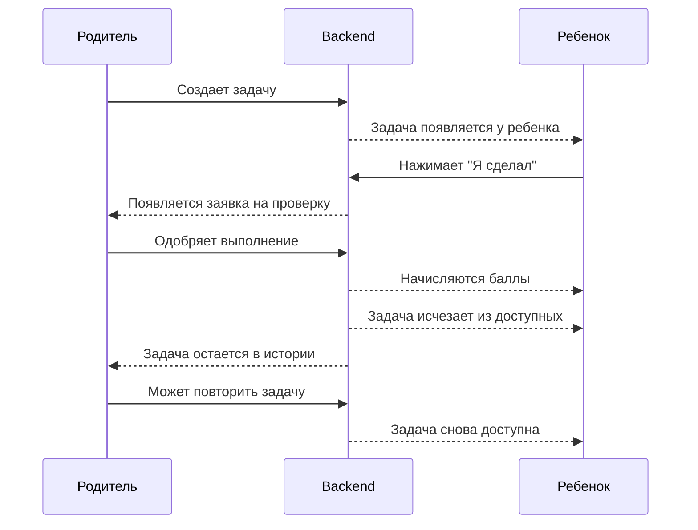
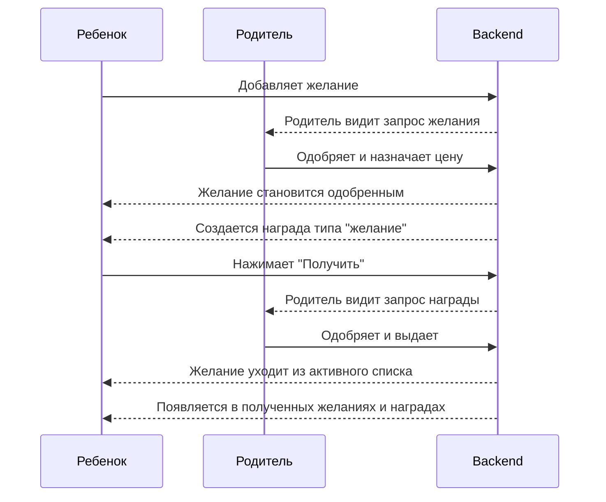
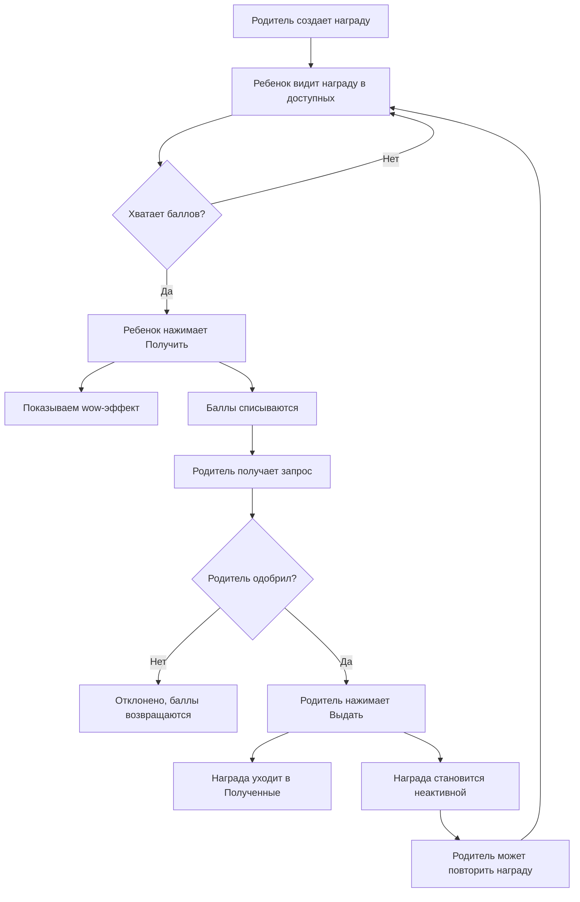
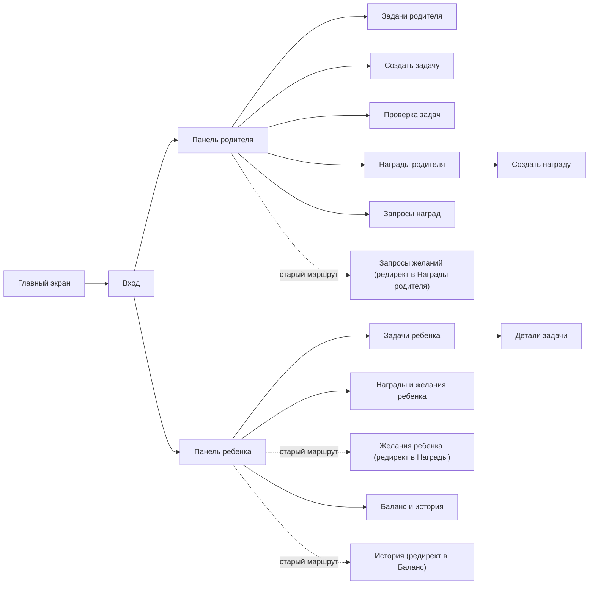

# easyQuest: схема логики приложения

## Общая Карта

## Что Происходит После Запуска

Главное правило: если пользователь уже авторизован, экран входа больше не показываем.

## Логика Задач

## Логика Желаний

## Логика Наград

## Карта Экранов

Правила навигации:

- В нижнем меню используем объединенные страницы, а не старые redirect-маршруты.
- У ребенка награды, желания и полученное находятся на `/child/rewards`.
- У ребенка баланс и история задач находятся на `/child/balance`.
- У родителя каталог наград и запросы желаний находятся на `/parent/rewards`.

## Состояния После Действий

| Действие | Что происходит |
| --- | --- |
| Родитель создал задачу | Задача активна и видна ребенку. |
| Ребенок выполнил задачу | Создается заявка `pending`. |
| Родитель одобрил задачу | Баллы начислены, задача становится неактивной. |
| Родитель повторил задачу | Задача снова активна. |
| Ребенок создал желание | Желание ждет одобрения родителя. |
| Родитель одобрил желание | Желание превращается в награду типа `wish`. |
| Ребенок нажал получить | Баллы списаны, родитель видит запрос. |
| Родитель выдал награду | Награда/желание уходит в историю полученных. |
| Родитель отклонил награду | Баллы возвращаются ребенку. |
