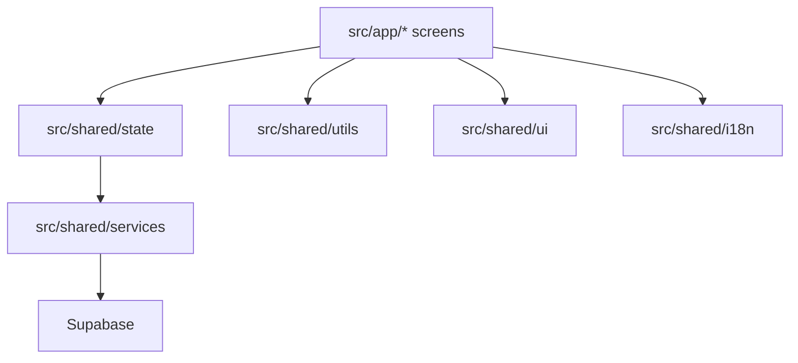

# easyQuest Architecture Notes

This project is an Expo Router React Native app with Supabase-ready data services.

## Main Layers

## Folder Responsibilities

- `src/app`: route screens only. Keep screen files focused on layout, local form state, and route params.
- `src/shared/state`: app-level hooks and domain actions that coordinate service calls and local state updates.
- `src/shared/services`: backend contracts and implementations. Keep Supabase row shapes inside service/mappers files.
- `src/shared/utils`: pure business rules such as balance, available tasks, visible wishes, and content helpers.
- `src/shared/ui`: reusable presentational components. Prefer adding small components here instead of repeating JSX in screens.
- `src/shared/i18n`: all user-facing text. New UI must add both `en` and `ru` keys.
- `docs/supabase`: SQL schema, migrations, and setup notes.

## UI Patterns

- Wrap route content in `AppScreen`.
- Put global top actions inside `AppHeaderMenu`; do not add separate language/logout buttons to screens.
- Use `AppBottomNavigation` for persistent bottom navigation on main parent/child screens. It is mounted in `src/app/_layout.tsx` outside the Expo Router `Stack`, so native route transitions do not drag it with the page. It wraps `BottomActionBar` and uses `QuestIcons`, so new navigation icons should be added to `QuestIcons` first.
- Keep bottom navigation off focused form/detail flows such as create, edit, invite, and task detail screens.
- Keep old or experimental tab navigation (`QuestTabBar`) aligned with current routes and translations.
- Use `SegmentedControl` for combined pages such as rewards/wishes and balance/history.
- Use `AppBottomSheet` for all bottom popups and drawers. It intentionally combines a transparent native `Modal` for top-layer presentation with `@gorhom/bottom-sheet` for gestures, dynamic sizing, and swipe-down close. Close buttons should request the sheet to close so the panel animates down before unmounting. Do not reimplement this as a plain `Modal`, custom `Animated` sheet, or `BottomSheetModal`.

## Navigation Rules

- Dashboard routes are role home screens: `/parent/dashboard` and `/child/dashboard`.
- The welcome/auth screens should not appear after a stored parent or child session exists.
- `child/rewards` is the single child page for rewards, wishes, and received history.
- `parent/rewards` is the single parent page for reward catalog and wish requests.
- Redirect routes such as `child/wishes`, `child/history`, and `parent/wish-requests` may exist for compatibility, but new UI should link to the combined pages.

## Backend Rules

- Screens should not call Supabase directly.
- Add operations to `FamilyPointsService` first, then implement both Supabase and local service behavior when possible.
- Map database DTOs in `mappers.ts`; do not spread raw Supabase rows through UI/state.
- Keep SQL migration docs idempotent when possible. If a script is destructive, explain when it is safe to run.

## Refactoring Checklist

- Move repeated JSX into `src/shared/ui`.
- Move repeated calculations into `src/shared/utils`.
- Move repeated service orchestration into `src/shared/state/domainActions.ts`.
- Add translation keys for all visible text in both languages.
- Run `npx tsc --noEmit`.
- Run `./node_modules/.bin/eslint .`.
- Smoke-test parent and child dashboard routes in web or simulator.

## AI Agent Notes

- `AGENTS.md` is the shortest entry point for GPT/Codex and Claude Code.
- `docs/ai-collaboration.md` contains project-specific skills for screen, navigation, backend, auth, and review work.
- Keep these docs synchronized when route structure or product invariants change.
